# Classical machine learning

Three end-to-end machine learning projects built with scikit-learn, plus the algorithms
behind them implemented from scratch in NumPy and checked against the library versions.

Worked from *Machine Learning with PyTorch and Scikit-Learn* (Raschka, Liu and
Mirjalili), chapters 2 to 11. Each project runs from raw data to a single held-out
evaluation, writes its figures to `outputs/`, and returns every number it measured, so
the tables below are generated rather than typed by hand.

| Project | Problem | Data | Headline result | Runtime |
| --- | --- | --- | --- | --- |
| [`diagnosis`](#1-diagnosing-breast-cancer) | Binary classification | 569 biopsies, 30 features | 0.998 ROC AUC, 2 missed malignancies in 114 cases | 35s |
| [`sentiment`](#2-sentiment-on-50000-movie-reviews) | Text classification | 50,000 IMDb reviews | 0.899 test accuracy, 0.962 ROC AUC | 4m 14s |
| [`housing`](#3-predicting-house-prices) | Regression | 2,929 house sales | 0.85 test R2, up from 0.75 for a linear fit | 3s |

```bash
git clone https://github.com/ysham123/classical-ML.git
cd classical-ML
make setup                       # virtual environment and dependencies
make data                        # Ames Housing (4 MB) and IMDb reviews (84 MB)
make run                         # all three projects
python -m classical_ml diagnosis # or just one; diagnosis needs no download
```

---

## 1. Diagnosing breast cancer

`src/classical_ml/projects/diagnosis.py` · [figures](outputs/diagnosis)

569 fine needle aspirates of breast masses, 30 features computed from the cell nuclei in
each image, and a malignant or benign diagnosis. Malignant is the positive class
throughout: a missed malignancy costs far more than a false alarm, so recall and the
count of false negatives matter more than raw accuracy.

Seven stages, in the order you would actually work through the problem.

**Baseline.** Scaling plus logistic regression, 0.9825 on the held-out set. Everything
after this has to beat a two-line pipeline.

**The feature space.** Two principal components hold 63.8% of the variance in the 30
features, and a classifier fitted in that 2D space still reaches 0.9495 under 10-fold
cross-validation. The projection computed by hand from the covariance eigenvectors
matches scikit-learn's to r = 1.0000.

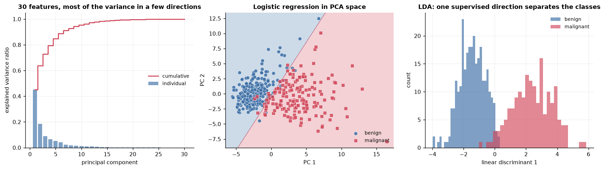

**Feature selection, three ways.** An L1 penalty keeps 16 of 30 coefficients at C = 1.
Sequential backward selection finds 8 features that score as well as all 30, and a KNN
classifier fitted on just those 8 gives identical test accuracy (0.9649) to one using
everything. Random forest impurity importance puts `worst concave points` on top.

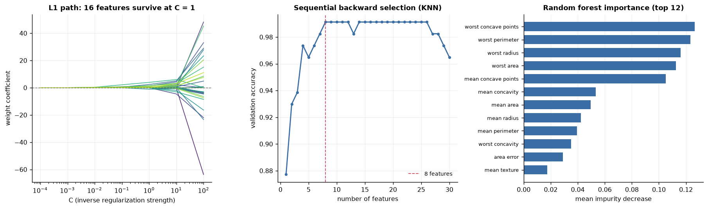

**Validation.** Stratified 10-fold cross-validation gives 0.9713 +/- 0.0372. The
learning curve closes to a 0.009 gap between training and validation accuracy, which
says the model is not overfitting and that more data would not help much.

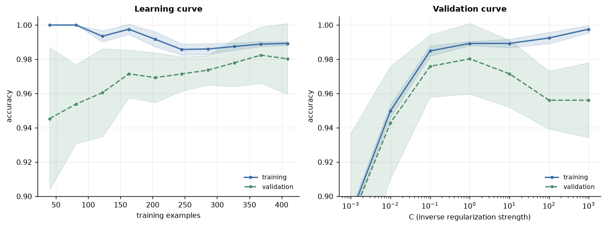

**Tuning.** The same SVM parameter space searched three ways, then nested
cross-validation to compare algorithm families without letting the tuning leak into the
estimate.

| Search | Best CV accuracy | Time |
| --- | --- | --- |
| Grid, 72 candidates | 0.9847 | 2.4s |
| Randomized, 40 draws | 0.9825 | 1.0s |
| Successive halving | 0.9625 | 0.4s |

| Family (nested 5x2 CV) | Accuracy |
| --- | --- |
| SVM | 0.9736 +/- 0.0149 |
| k-nearest neighbors | 0.9604 +/- 0.0247 |
| Random forest | 0.9582 +/- 0.0128 |
| Decision tree | 0.9341 +/- 0.0155 |

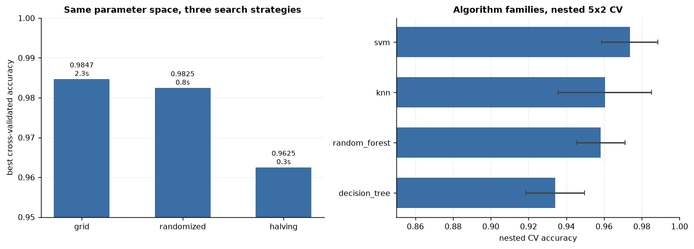

**Ensembles.** A majority vote over logistic regression, a decision tree and KNN,
against bagging, AdaBoost and gradient boosting. By cross-validated ROC AUC the vote
(0.9951) lands between its best member and the boosted ensembles, and on this dataset
plain logistic regression (0.9955) is as good as any of them. Ensembles are not free
accuracy; they pay off when the base learners fail in different ways, and here they do
not fail much to begin with.

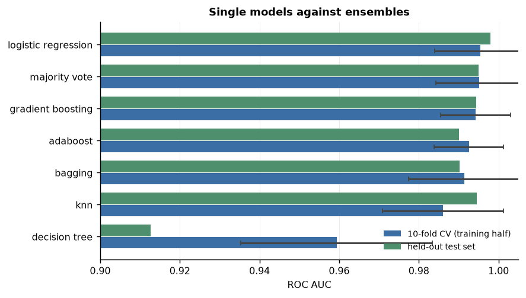

**Held out.** One pass with the configuration the grid search chose (RBF kernel,
C = 100, gamma = 0.001):

| Metric | Value |
| --- | --- |
| Accuracy | 0.9737 |
| Precision | 0.9756 |
| Recall | 0.9524 |
| F1 | 0.9639 |
| Matthews correlation | 0.9433 |
| ROC AUC | 0.9980 |
| Average precision | 0.9969 |
| False negatives / false positives | 2 / 1 |

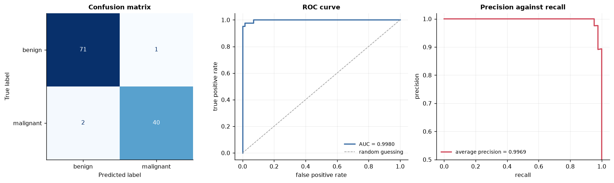

Worth stating plainly: the tuned SVM (0.9737) scores slightly below the untuned
baseline (0.9825) on the test set. That gap is one case out of 114, well inside the
noise of a test set this small, and the nested cross-validation on the training half is
the more reliable comparison. It is a good reminder that a single test-set number is an
estimate with a standard error, not a verdict.

---

## 2. Sentiment on 50,000 movie reviews

`src/classical_ml/projects/sentiment.py` · [figures](outputs/sentiment)

50,000 IMDb reviews, half positive and half negative, as raw text: HTML tags,
inconsistent casing, emoticons that carry real signal. The same job is done three times
under different constraints.

**In memory.** Clean the text with a regex that strips markup while preserving
emoticons, tokenize with and without Porter stemming, weight with tf-idf, and grid
search a logistic regression over tokenizer, stop words and regularization strength.
The search runs on a stratified 5,000-document subsample (Porter stemming the full
corpus once per candidate is what makes the textbook version take 40 minutes), and the
winning configuration is then refitted on all 25,000 training documents.

Result on the held-out 25,000: **0.8989 accuracy, 0.9625 ROC AUC**.

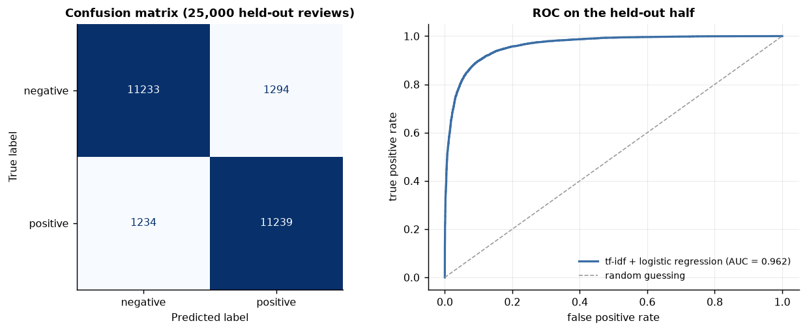

The fitted coefficients are readable, which is most of the reason to reach for a linear
model on text in the first place.

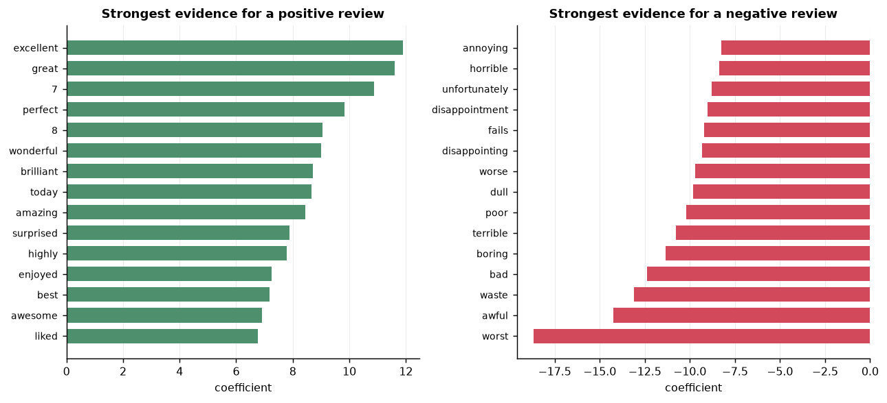

**Out of core.** The same problem with a memory budget: `HashingVectorizer` replaces the
vocabulary with a hash function so no state carries between batches, and an SGD
classifier is updated with `partial_fit` over 45 batches of 1,000 documents streamed
off disk. It reaches 0.8438 on a holdout set taken before training started, giving up
about five points of accuracy in exchange for never holding the corpus in memory.

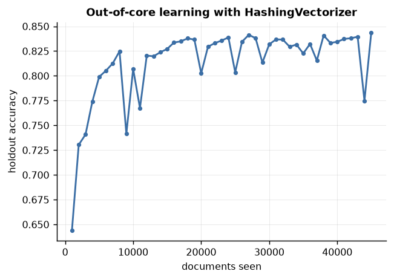

**Without labels.** Latent Dirichlet allocation over all 50,000 reviews recovers ten
topics from word co-occurrence alone. Nothing tells it that the corpus is about films.

| Topic | Top words |
| --- | --- |
| 1 | horror, effects, budget, low, special, dead |
| 2 | comedy, music, fun, dvd, loved, wonderful |
| 5 | family, father, girl, woman, mother, school |
| 7 | role, performance, actor, performances, plays, played |
| 8 | war, american, black, country, political, white |
| 10 | worst, minutes, money, wasn, script, maybe |

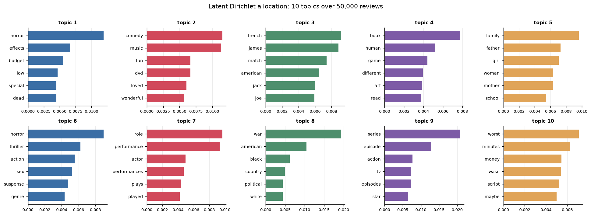

---

## 3. Predicting house prices

`src/classical_ml/projects/housing.py` · [figures](outputs/housing)

2,929 residential sales in Ames, Iowa between 2006 and 2010. The project is a tour of
the ways a linear model meets reality.

**Looking first.** A scatter matrix and a correlation matrix over the five predictors,
which is what decides whether a linear model is reasonable here at all. Overall quality
correlates with price at 0.80 and living area at 0.71, and neither is collinear enough
with the other to cause trouble.

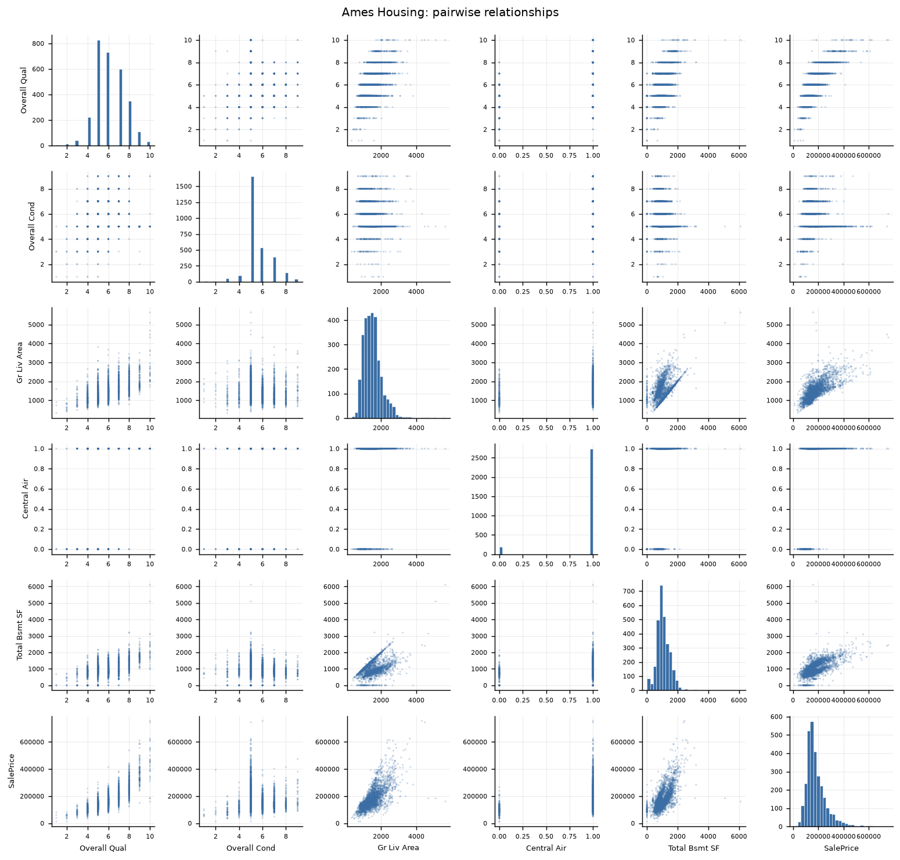

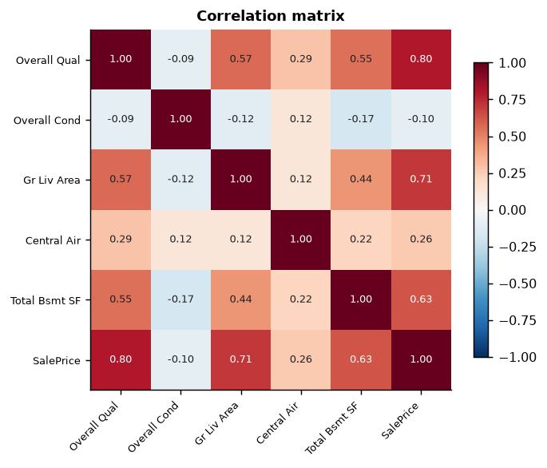

**Fitting the line twice.** Gradient descent written by hand and scikit-learn's closed
form agree: 111.67 USD per square foot of living area, on a 13,343 USD intercept.

**Outliers.** RANSAC fits only the 63% of sales it treats as inliers and comes back
with a shallower slope of 106.35, because a handful of very large and very expensive
houses drag the ordinary least squares line upward.

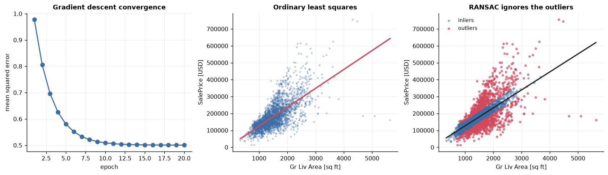

**Diagnostics and regularization.** Multiple regression on five predictors reaches
R2 = 0.769 on the training set and 0.752 on the test set, with a mean absolute error
around 24,900 USD. The residuals fan out with price, which is the signature of a model
that is wrong in a structured way rather than merely imprecise. Ridge and lasso match
the unpenalized fit at 0.752; elastic net at these settings does slightly worse (0.727).
With five predictors and no collinearity problem, there is little for a penalty to do.

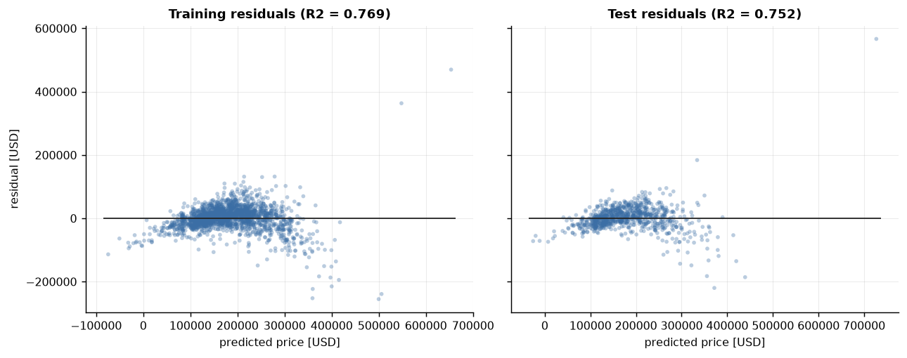

**Nonlinearity.** Price rises faster than linearly with overall quality, so polynomial
terms lift R2 from 0.639 to 0.700 on that one predictor.

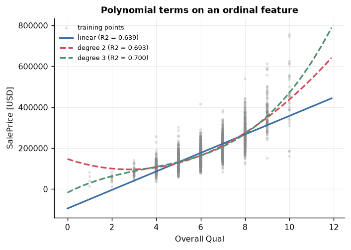

A random forest, which assumes nothing about the shape of the relationship, reaches
**0.847 on the test set** against 0.752 for the linear model. The gap is the part of the
price that was never a straight line. The training R2 of 0.976 against that 0.847 is the
usual forest overfit, visible as the tighter band of training residuals below.

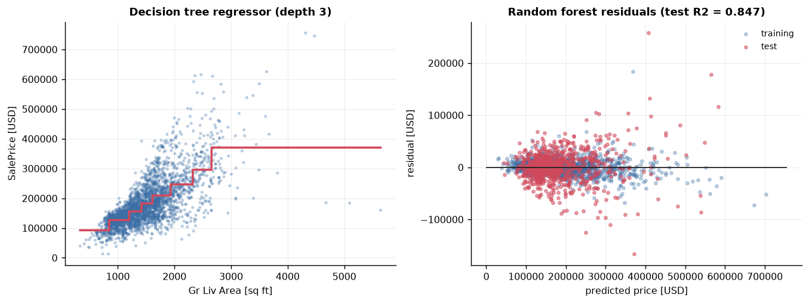

---

## Algorithms implemented from scratch

Everything in `src/classical_ml/algorithms/` is written directly in NumPy. Each one is
verified against a reference rather than merely asserted to work, and the projects use
them alongside the library implementations.

| Implementation | What it is | How it is verified |
| --- | --- | --- |
| `Perceptron` | Rosenblatt's rule, one update per example | Reaches zero training errors on separable Iris in 6 epochs |
| `AdalineGD`, `AdalineSGD` | Batch and stochastic gradient descent | Loss decreases monotonically; diverges at eta = 0.1 without scaling, as predicted |
| `LogisticRegressionGD` | Sigmoid activation, log-likelihood loss | Same predictions as `LogisticRegression`, weight vectors aligned to cosine > 0.99 |
| `LinearRegressionGD` | Least squares by gradient descent | Matches the closed-form solution to 1e-3 |
| `pca_from_scratch` | Covariance matrix, eigendecomposition, projection | Explained variance identical to `PCA` to 1e-10; components orthonormal |
| `lda_from_scratch` | Within-class and between-class scatter | Projection matches `LinearDiscriminantAnalysis`; rank is exactly c - 1 |
| `SBS` | Sequential backward feature selection | Removes one feature per step and leaves the caller's estimator unfitted |
| `MajorityVoteClassifier` | Voting ensemble on the estimator API | Passes `clone`, cross-validates, exposes nested parameters to `GridSearchCV` |
| `NeuralNetMLP` | One hidden layer, backpropagation by hand | Every gradient checked against central finite differences to 1e-6 |

The gradient check is the one worth pointing at. An accuracy threshold does not catch a
subtly wrong derivative, because gradient descent tends to make progress anyway; a
finite-difference comparison on every weight and bias does.

## Layout

```
src/classical_ml/
├── projects/            three end-to-end projects, each with run()
│   ├── diagnosis.py
│   ├── sentiment.py
│   └── housing.py
├── algorithms/          the models built from scratch in NumPy
│   ├── linear.py
│   ├── decomposition.py
│   ├── feature_selection.py
│   ├── ensemble.py
│   └── neural_net.py
├── datasets.py          loaders with an on-disk cache
├── plotting.py          decision regions and the shared figure style
├── report.py            timing, metric collection, generated results tables
└── compat.py            shims for scikit-learn API changes since the book
outputs/                 figures, results.json and the generated RESULTS.md
tests/                   44 tests, including the gradient check
```

## Reproducing

Every result is seeded. `make run` regenerates every figure, `outputs/results.json` and
[`outputs/RESULTS.md`](outputs/RESULTS.md), which records each project's metrics along
with the library versions that produced them.

```bash
make test    # 44 tests
make lint    # ruff
```

CI runs the linter, the test suite and the `diagnosis` project on Python 3.11, 3.12 and
3.13. It sets `CLASSICAL_ML_OFFLINE=1`, so anything that would silently reach for the
network fails instead; the tests that need a downloaded corpus are skipped there and
marked `needs_data`.

Datasets: Iris, Wine and Breast Cancer Wisconsin ship with scikit-learn. Ames Housing
and the IMDb review corpus are downloaded once into `data/` (gitignored) by `make data`.

## Notes on the source material

The book targets scikit-learn 1.0 and this repository runs on 1.9, so a few calls have
moved. `LogisticRegression(penalty='l1')` is deprecated in favour of `l1_ratio`,
`liblinear` no longer wraps itself in one-versus-rest for multiclass problems, and
`SVC(probability=True)` is superseded by `CalibratedClassifierCV`. The first two are
handled in `compat.py` so the project code stays readable; the third is used directly.

## License

MIT
